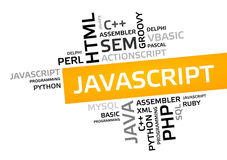

##Newbie
It has been about one and a half years since I first started programming. When I first started, I had no idea how much programming languages existed. Still to this day I have no idea how many exist. So far, I've learned Java, C, and C++. I am currently learning the programming language of JavaScript and I am what people would consider a "noob" at it. I initially thought that learning a new programming language would be like learning a new human language, but in computer science that is not the case. 

When I first used JavaScript in a tutorial I thought that it was like all the other programming languages I've already learned. As I followed the instructions, nothing confused me. It seemed to me that the only differences from JavaScript and the previous languages were the way variables, arrays, and objects were represented and the syntax. However, JavaScript is more like Java rather than C and C++ which is what one would assume since "java" is in both their names. From what I know so far, JavaScript is much simpler than C and C++. In JavaScript, you don't have to be as in tuned with the computer such as creating memory and accessing data in that memory location.

##WOD
JavaScript does not seem like it will be too hard to learn, but that does not mean you don't need to practice. I find that practice WODs are very useful as it provides a practice in coding in JavaScript, but it also challenges your problem-solving skills. I believe that this is a good style of learning as it gives you a real-life experience in coding. When working in the professional field you will be given a task and you are going to have to solve whatever problem you are having on your own. With WODs, you are given a problem to solve which tests and improves your logical thinking. The time limit in the WODs are also a great addition as it shows you whether you need to improve or if you are meeting the standards. However, knowing you have a time limit could be very stressful. This has caused me to make mistakes. Sometimes I'd rush to get the best time possible and it'd cause me to miss out a few details or do more than I should have. I believe that you should not penalize yourself for not completing the WOD in the time limit, but use it as an opportunity to see how you could improve. Maybe you could look at how you could have written the code differently. Don't let the time limit penalize you for trying out the different syntax which JavaScript provides such as multiple conditional (ternary) operators. If you are not penalized for not having the best time, I believe that's when it would work best.
