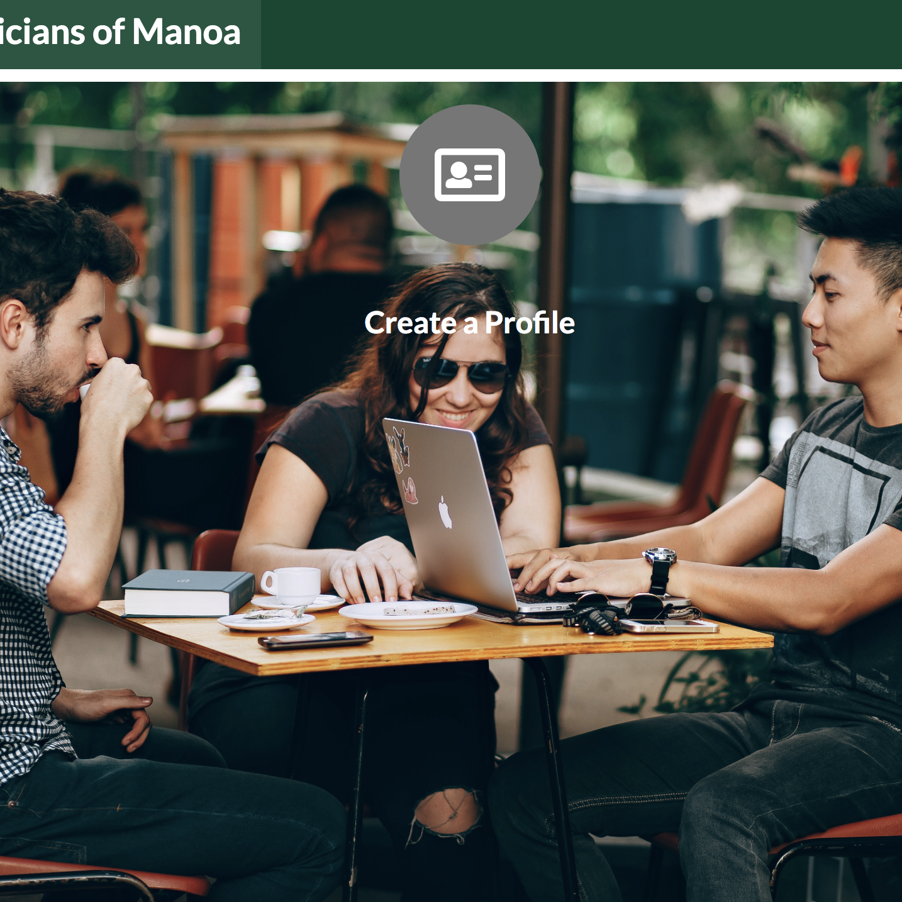
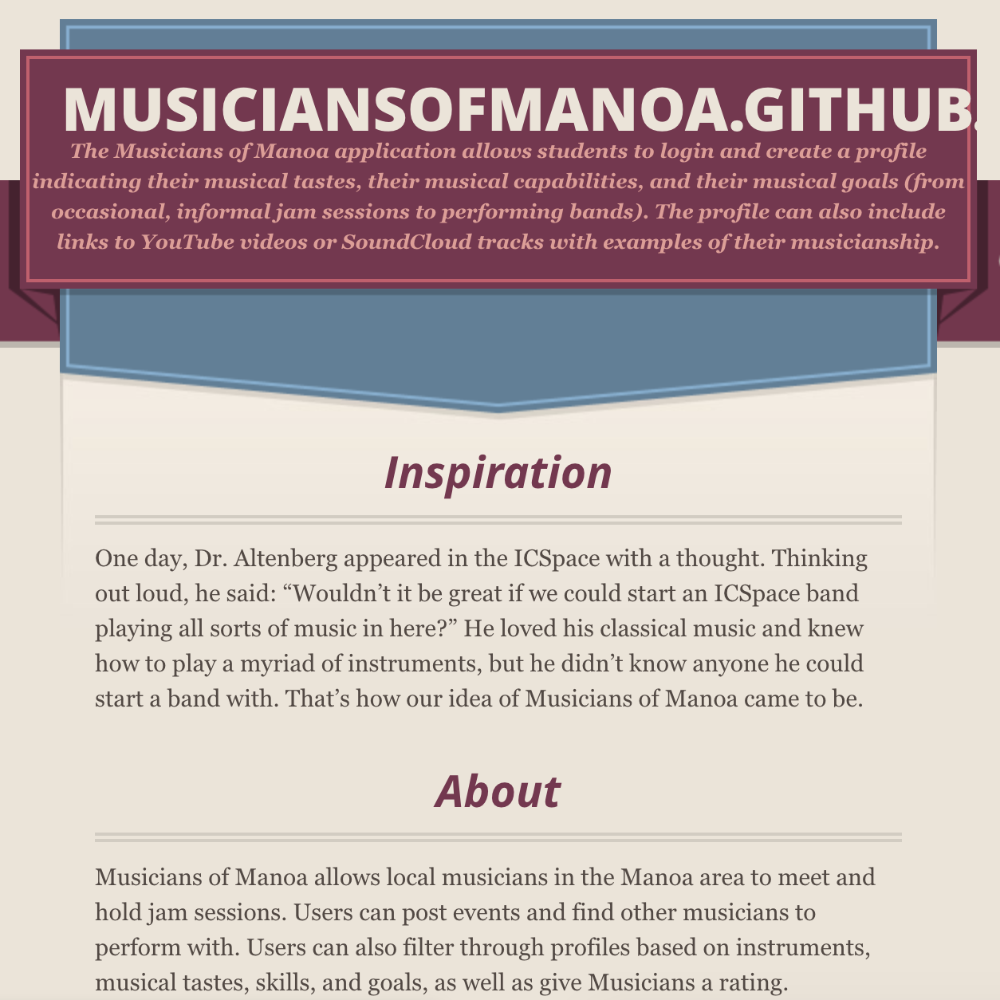

I worked in a small group of six people on an application called "Musicians of Manoa" designed for University of Hawaii at Manoa students to share musical talents and experience informal jam sessions. Students are allowed to create and login to their profiles and view other users. Users are allowed to share their own experiences, musical capabilities, musical golas, musical tastes, biography, and a profile picture. Users are then allowed to browse through other users profiles by musical taste or musical capabilities and view upcoming jam sessions.

My primary role in this project was to implement a super user, "admin", who is allowed to access all user profiles and have the power to filter out any unnecessary or inappropriate information and delete profiles. Also, I allowed the admin to view all the events and jam sessions created and have the option to decline them if necessary. Under the admin profile, these features were added to the NavBar of the application. These features are protected and only avaliable to the admin profile.

In result of this project, I gained experience in working in a group. At first, there were problems with merging our codes together, but, as we got more experience, we were able to overcome the issue and have it occurs again. I learned how to work as a group and communicate. I saw the potential of working in a group to accomplish a big project. I also learned about databases and how to implement them into application. Since I implemented the admin user, I had to understand how to access multiple databases and how to manipulate them. The experience from this project gives me the confidence on using GitHub for any future project.

<h2>The Project</h2>
<h3>[The Website](http://musiciansofmanoa.meteorapp.com/#/)</h3>

<h3>[GitHub.io homepage](https://musiciansofmanoa.github.io/)</h3>

